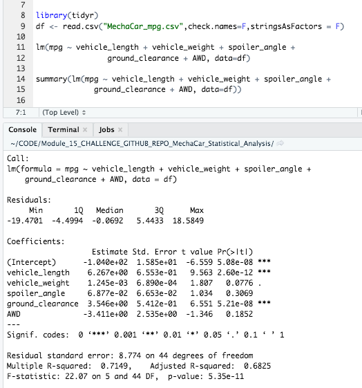

# MechaCar_Statistical_Analysis

## Overview of the Project

---------------------------------------------
## Resources:

Data Sources: 

    MechaCar_mpg.csv
    Suspension_Coil.csv

Software: 

    R 4.0.3, Rstudio 1.3.1093, 
    Visual Studio Code 1.49.2

--------
## Linear Regression to Predict MPG

From the MechaCar_mg dataset, a variety of questions were addressed by linear regression to predict mpg.  A summary of these questions, their corresponding answers, and an image of the R script and console are provided for illustration below:

### Questions Addressed:
Which variables/coefficients provided a non-random amount of variance to the mpg values in the dataset? Is the slope of the linear model considered to be zero? Does this linear model predict mpg of MechaCar prototypes effectively?

### Results:
Using the Tidyr package's linear model function along with the summary method in R, the desired statistical summaries were easily obtained.  Firstly, some variables/coefficients did provide a non-random amount of variance to the mpg values in the dataset.  In particular, vehicle Length and ground clearance were statistically significant as their p-values fell below the .05 significance level (alpha).  Additionally, it may be worth noting that the y-intercept was also statistically significant, meaning there are other variables and factors that may contribute to the variation in mpg values that were not included in the model.

The slope of the linear model is not zero, according to the statistical summary results. Assuming we have a confidence level of 95%, the p-value is far below the corresponding .05 significance level and, therefore, we have sufficient statistical reasoning to reject the null hypothesis that the slope is zero.  Lastly, regarding the predictive capability of the model, this linear model does indeed predict mpg of MechaCar prototypes fairly well considering the coefficient of determination (r-squared) produced a value of 0.7149.  This means that the linear model explains about 71 percent of the variability, indicating our model does a decent job of predicting our dependent variable (mpg).

-----------------

---------------------------

## Summary Statistics on Suspension Coils

From the "Suspension_Coil.CSV" dataset, questions were addressed that involved fiinding summary statistics on suspension coils.  The findings and illustrative images of the R script and console results are provided below:

### Questions Addressed:
The design specifications for the MechaCar suspension coils dictate that the variance of the suspension coils must not exceed 100 pounds per square inch. Does the current manufacturing data meet this design specification for all manufacturing lots in total and each lot individually?

### Results:
From utitlizing "group by" and "summarize" methods in R, the variance, as well as a variety of other statistical metrics were easily calculated for the PSI overall totals as well as the PSI grouped for each manufacturing lot in the dataset.  To calculate these metrics, including the determination of whether the design specifications for the MechaCar suspension coils were within range, the following codes were run in R:

---------------------------

According to the first resulting "total_summary" table, the variance in PSI for all manufacturing lots as a whole appears within the desired range of 100 pounds per square inch (or less) with a value of approximately 62.29.

--------------------------------
However, when we examine the variance in PSI grouped by each of the three lots in the "lot_summary" table, we find that not all of the results are within specifications.  In particular, lot 3 exhibited a variance far above the 100 limit with a value of 170.29.

--------------------

