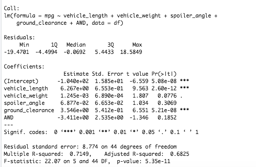
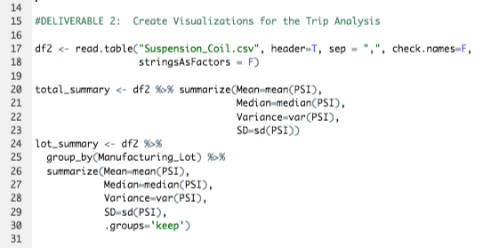
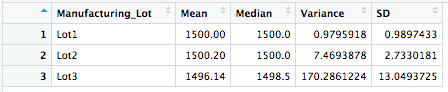
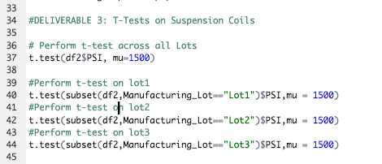
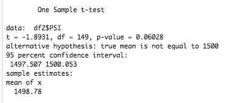
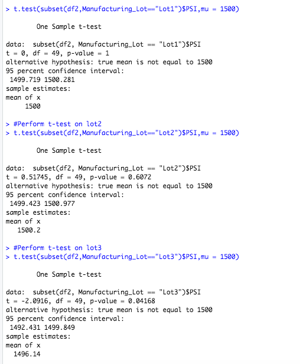

# MechaCar Statistical Analysis

## Overview of the Project

The purpose of this project was to utilize R programming language and Rstudio GUI to aid a fictitious company called AutosRU in performing statistical tests on their datasets for a prototype vehicle called "MechaCar".  In essense, the prototype was suffering from production troubles and needed insights using data analysis to help the manufacturing team uncover insights about what may need improvements.  The statistical tests included a variety of hypothesis testing procedures on the company-specific datasets.  Below, there are three sets of analyses described in detail followed by an additional statistical study design to compare performance of the MechaCar vehicles against similar vehicles from other manufacturers.

---------------------------------------------
## Resources:

Data Sources: 

    MechaCar_mpg.csv
    Suspension_Coil.csv

Software: 

    R 4.0.3, Rstudio 1.3.1093, 
    Visual Studio Code 1.49.2

--------
## Linear Regression to Predict MPG

From the MechaCar_mg dataset, a variety of questions were addressed by utlizing linear regression to predict mpg.  A summary of these questions, their corresponding answers, and images of the R script code and console results are provided for illustration below.

### Questions Addressed:
Which variables/coefficients provided a non-random amount of variance to the mpg values in the dataset? Is the slope of the linear model considered to be zero? Does this linear model predict mpg of MechaCar prototypes effectively?

### Results:
Using the Tidyr package's linear model function along with the summary method in R, the desired statistical summaries were easily obtained using the following codes.  

Firstly, some variables/coefficients did provide a non-random amount of variance to the mpg values in the dataset.  In particular, vehicle Length and ground clearance were statistically significant as their p-values fell below the .05 significance level (alpha).  This indicates that vehicle length and ground clearance appear to have statistically significant impact on fuel efficiency (mpg).  Additionally, it may be worth noting that the y-intercept was also statistically significant, meaning there are other variables and factors that may contribute to the variation in mpg values that were not included in the model.

The slope of the linear model is not zero, according to the statistical summary results. Assuming we have a confidence level of 95%, the p-value is far below the corresponding .05 significance level and, therefore, we have sufficient statistical reasoning to reject the null hypothesis that the slope is zero.  Lastly, regarding the predictive capability of the model, this linear model does indeed predict mpg of MechaCar prototypes fairly well considering the coefficient of determination (r-squared) produced a value of 0.7149.  This means that the linear model explains about 71 percent of the variability, indicating our model does a decent job of predicting our dependent variable (mpg).

---------------------------

## Summary Statistics on Suspension Coils

From the "Suspension_Coil.CSV" dataset, questions were addressed that involved finding summary statistics on suspension coils.  The findings and illustrative images of the R script and console results are provided below:

### Questions Addressed:
The design specifications for the MechaCar suspension coils dictate that the variance of the suspension coils must not exceed 100 pounds per square inch. Does the current manufacturing data meet this design specification for all manufacturing lots in total and each lot individually?

### Results:
From utitlizing "group by" and "summarize" methods in R, the variance, as well as a variety of other statistical metrics were easily calculated for the PSI overall totals as well as the PSI grouped for each manufacturing lot in the dataset.  To calculate these metrics, including the determination of whether the design specifications for the MechaCar suspension coils were within range, the following codes were run in R:

According to the first resulting "total_summary" table, the variance in PSI for all manufacturing lots as a whole appears within the desired range of 100 pounds per square inch (or less) with a value of approximately 62.29.

However, when we examine the variance in PSI grouped by each of the three lots in the "lot_summary" table, we find that not all of the results are within specifications.  In particular, lot 3 exhibited a variance far above the 100 limit with a value of 170.29.

--------------------

## T-Tests on Suspension Coils

Still using the "Suspension_Coil.CSV" dataset, t-tests were performed to address questions about PSI as a whole and for each lot.  A summary of these questions, their corresponding answers, and images of the R script code and console results are provided for illustration below.

### Questions Addressed:
Are all manufacturing lots (as a whole) statistically different than a population mean of 1,500 pounds per square inch?  What about each lot individually?

### Results:

To perform the t-tests using R, first the t.test method was utilized to compare all lots against a population mean of 1,500 pounds per square inch.  Following this, the t.test method for each lot was subsetted according to lot number in the t.test method as seen below.

From the t-test to compare all lots against the population mean of 1,500 we can see that the sample mean was 1498.78 and the p-value is 0.06028.  Although the p-value is low, it is not low enough to reject the null hypothesis that the population's true mean is 1,500 because it did not fall below the significance level of 0.05 (see image below).

Finally, the t-test to compare each lot produced varying results for each lot.  For lot 1, the mean was exactly 1,500 and so the p-value was exactly 1.  This is a perfect match to the population mean and is therefore not statistically significant as there was no difference between the two.  For lot 2, the mean was 1,498.78 with a p-value of 0.06.  Although low, this p-value is also not statistically different enough to reject the null hypothesis.  However, lot 3 had a mean of 1,496.14 and a the p-value of 0.04168.  Therefore, unlike the other two lots, lot 3 is statistically different from the population mean since its p-value is below 0.05.

-----------------
## Study Design: MechaCar vs Competition

To further aid AutosRU in improving their MechaCar prototype for maximal performance against the competition, designing another study design may be worth further analysis to compare metrics with competitors.  In this study design, the MechaCar data could be analyzed against one or more competitor's comparable data to highlight a variety of metrics which may be of interest to potential consumers as well as AutosRU's manufacturing.

### Choosing a metric to test:

Although there a multitude of possible metrics to consider, it may be useful to focus on how MechaCar's mean highway fuel efficiency (measured in MGP) in particular and compare it to the mean value of multiple competitors.  To do this, it would be ideal to compare vehicles which are as similar as possible as this could theoretically minimize "statistical noise" when attempting to determine statistical significance.

### What is the null hypothesis or alternative hypothesis?

Once we have selected a metric to analyize, it is imperative to identify our null and alternative hypotheses.  The null hypothesis, in this case, would be that there is no statistical difference between the fuel efficiency of the MechaCar prototype and the fuel efficiency of competitors.  Of course, this would mean the alternative hypotheses would be that there is indeed a statistical difference.

### What statistical test would you use to test the hypothesis? And why?

In order to test the hypotheis that there is no statistical difference between the MechaCar prototype and the fuel efficiency of competitors, we could use a one-way ANOVA test.  Also known as the analysis of variance test, the ANOVA test would allow us to test the null hypothesis that the means of all groups are equal.  As such, this would correspond well with our original orchestration of the null hypothesis.  In this case, the sample means would include MechaCar's MPG values and mean MPG values from samples of similar competitor vehicles.

### What data is needed to run the statistical test?

To perform this ANOVA test, we would need one continous, numerical variable for the dependent variable and MPG would satisfy that requirement.  For the independent variable specification when using ANOVA, we could compare vehicles of the same class using multiple categorical variables which would be the different vehicles for comparison, including the MechaCar prototype.  Furthermore, we would want the sample sizes of each group to be sufficiently large (at least 30) and we would also operate under the assumption that the dependent variable (MPG) is normally distributed and that the variance among each group is similar.

### How to analyze the results:
We could use R's aov() method to run the ANOVA test and use R's summary() function to retrieve the summary statistics which would house our p-value.  If the p-value resulted in a value below 0.05 (assuming a 95% confidence level) we would have sufficient statistical reasoning to reject the null hypotheses that the means for all groups were equal.  Note, one limitation of the ANOVA test would be that we would not be able to tell which categorical variable(s) was/were the culprit for the statistical significance.  However, supposing we reject the null based on this test result, we could also rerun the anova test without the MechaCar sample MPG and compare the competitors to check that their means were all statistically the same without the MechaCar prototype.  This may provide us additional insight about MechaCar's contribution to the statistical significance.  In any case, the ANOVA test can prove quite useful for comparing the means of a continous numerical variable across a number of groups and could aid AutosRU in improving their prototype maximally.